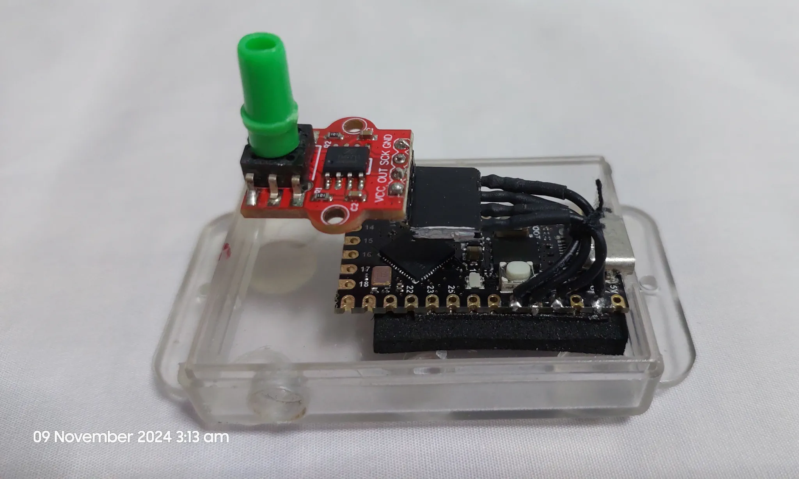
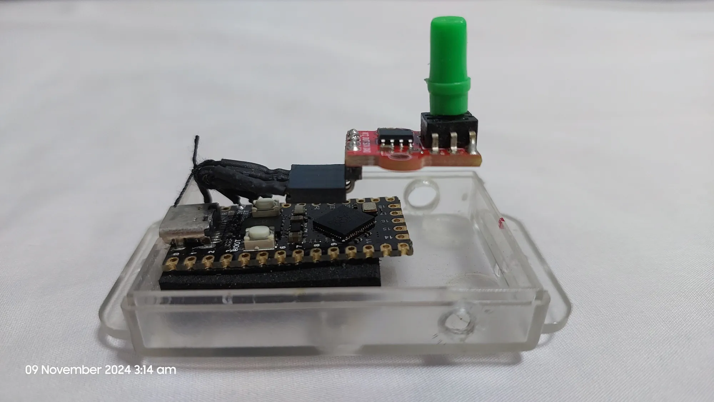
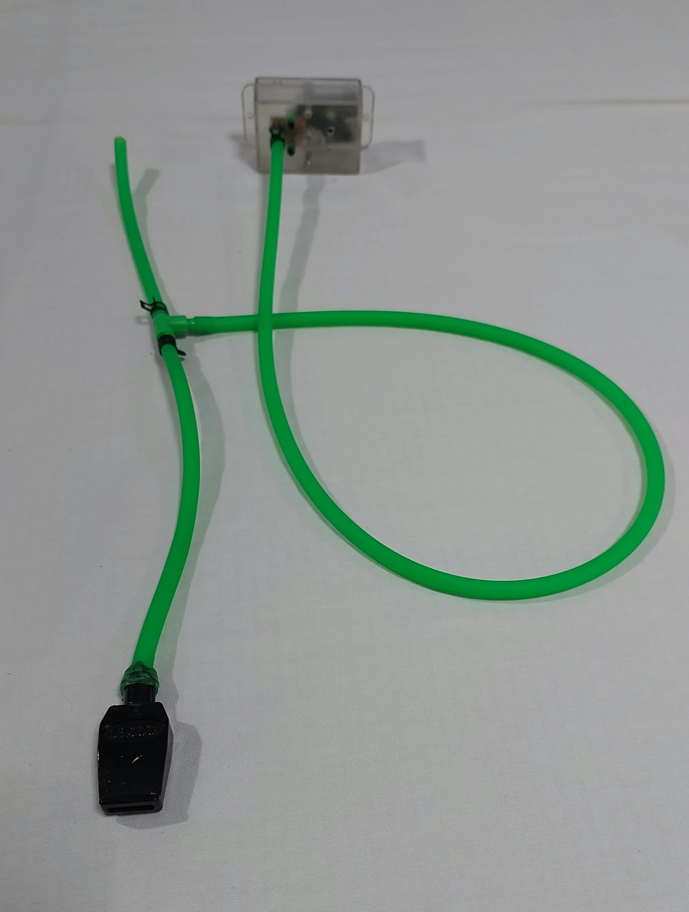
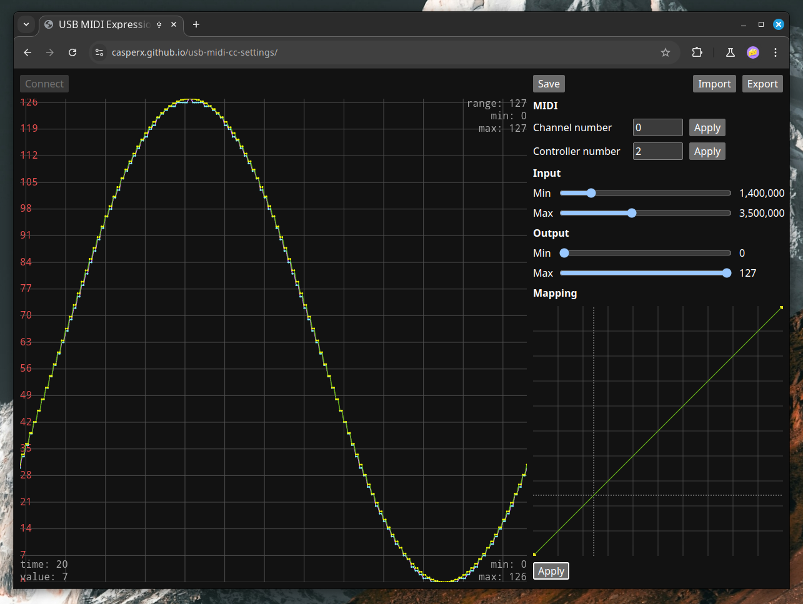
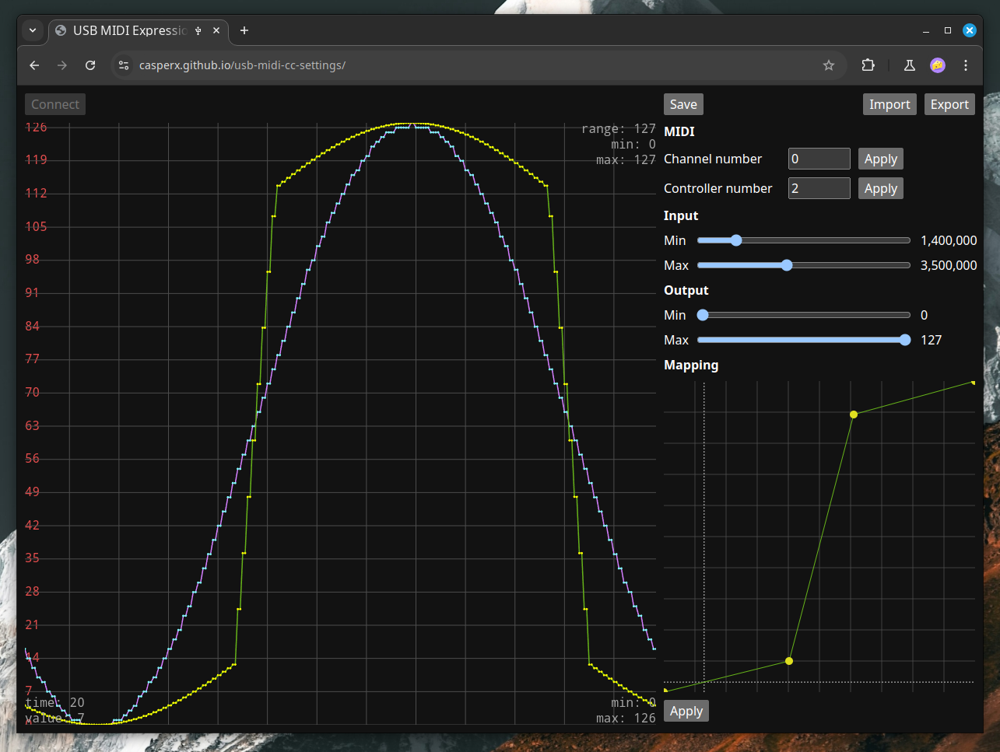

# USB MIDI CC

Map Air pressure from TM7711 sensor into MIDI channel 0, MIDI CC 2.

> Can be used with VST wind instrument.

### Working device

https://github.com/user-attachments/assets/03819590-ca50-4554-8af0-49113f557651

Based on Raspberry Pi Pico.

Store following configuration in Flash.

- MIDI channel
- MIDI CC
- Sensor Input and MIDI CC Output range
- Mapping curve (50 points max.)

To configure the device, please go [here](https://casperx.github.io/usb-midi-cc-settings/)

>  please use Chromium-based browser, as it need WebUSB to function.

On the left, you'll have real time display of signal values from the device.
It shows two lines, green and blue. Blue line is the MIDI CC value currently output from device.
Green line is the preview of your mapping curve. If you press apply, it will become the same  value.

Press save to persist settings to device's Flash. It'll be loaded on startup.

You can calibrate the device by adjusting input range until it lies inside the display frame.
